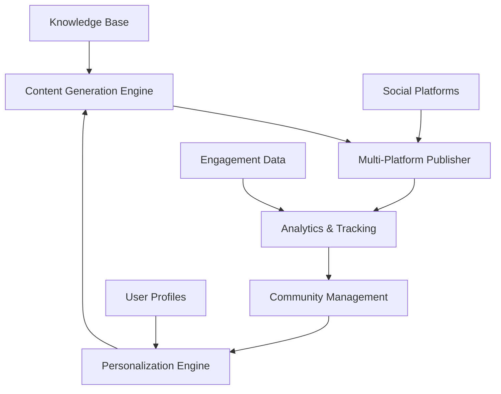

# Kế hoạch Triển khai AI Blogging & Knowledge Sharing System

## 🎯 Mục tiêu Tổng quan
- **Tầm nhìn**: Trở thành platform chia sẻ kiến thức kỹ thuật hàng đầu cho cộng đồng Việt Nam
- **Mục tiêu**: Tiếp cận tối đa người Việt Nam quan tâm đến AI/Tech
- **Ngôn ngữ**: Song ngữ Anh-Việt với focus chính tiếng Việt

---

## 📋 Phase 1: Foundation & Content Automation (Tháng 1-2)

### 1.1 LangChain/LangGraph Content Generator
**Timeline**: 3-4 tuần

#### Tech Stack:
- **Framework**: LangChain + LangGraph
- **LLM**: OpenAI GPT-4o/Claude-3.5 Sonnet  
- **Vector DB**: Chroma/Pinecone cho RAG
- **Backend**: FastAPI + Python
- **Database**: PostgreSQL + Redis

#### Features:
```python
# Core Components
class ContentGenerator:
    - auto_generate_blog_posts()
    - translate_content()  # En <-> Vi
    - optimize_seo()
    - generate_social_snippets()
    - create_visual_content()

class KnowledgeRAG:
    - index_existing_docs()
    - answer_technical_questions()
    - suggest_related_content()
    - extract_insights()
```

#### Workflow:
1. **Content Planning**: AI tự động suggest topics dựa trên trends
2. **Research & Generation**: RAG từ knowledge base + external sources
3. **Multi-language**: Auto translate + human review
4. **SEO Optimization**: Keywords, meta tags, structured data
5. **Quality Assurance**: Auto fact-check + expert review

### 1.2 Content Management System
**Timeline**: 2-3 tuần

#### Features:
- **Editorial Calendar**: AI-powered content scheduling
- **Version Control**: Git-based content management
- **Collaboration**: Multi-author workflow
- **Template System**: Consistent formatting across chapters
- **Asset Management**: Images, diagrams, code snippets

---

## 📋 Phase 2: Multi-Platform Publishing (Tháng 2-3)

### 2.1 Platform Integration
**Timeline**: 4-5 tuần

#### Primary Platforms:
1. **GitHub Pages/Vercel**: Main documentation site
2. **Medium**: Vietnamese tech community
3. **Dev.to**: International developer audience  
4. **LinkedIn**: Professional networking
5. **Facebook Groups**: Vietnamese tech groups
6. **YouTube**: Video content (tutorials, demos)
7. **Podcast**: Technical discussions (Spotify, Apple)

#### Technical Implementation:
```python
class MultiPlatformPublisher:
    - publish_to_medium()
    - publish_to_devto()
    - post_to_linkedin()
    - share_to_facebook_groups()
    - upload_to_youtube()
    - distribute_podcast()
```

### 2.2 Content Adaptation
**Timeline**: 2-3 tuần

#### Platform-Specific Optimization:
- **Medium**: Long-form Vietnamese articles
- **Dev.to**: Technical tutorials with code
- **LinkedIn**: Professional insights + career advice
- **Facebook**: Community discussions + Q&A
- **YouTube**: Visual demos + tutorials
- **Podcast**: Expert interviews + deep dives

---

## 📋 Phase 3: Engagement & Analytics (Tháng 3-4)

### 3.1 Interaction Tracking System
**Timeline**: 3-4 tuần

#### Analytics Stack:
- **Google Analytics 4**: Website traffic
- **Mixpanel**: User behavior tracking
- **Social Media APIs**: Platform-specific metrics
- **Custom Dashboard**: Unified analytics view

#### Key Metrics:
```python
class EngagementTracker:
    # Content Performance
    - page_views_by_platform()
    - time_on_page()
    - bounce_rate()
    - content_completion_rate()
    
    # Community Engagement  
    - comments_sentiment_analysis()
    - shares_and_reactions()
    - community_growth_rate()
    - expert_participation_rate()
    
    # Business Impact
    - lead_generation()
    - career_advancement_tracking()
    - skill_development_progress()
```

### 3.2 Community Management
**Timeline**: 2-3 tuần

#### Features:
- **Auto-moderation**: AI-powered spam detection
- **Expert Matching**: Connect questions với subject matter experts
- **Gamification**: Contributor rewards system
- **Events Management**: Webinars, workshops, meetups

---

## 📋 Phase 4: Advanced Features (Tháng 4-6)

### 4.1 AI-Powered Personalization
**Timeline**: 4-5 tuần

#### Features:
```python
class PersonalizationEngine:
    - recommend_learning_path()
    - suggest_relevant_content()
    - track_skill_progression()
    - create_personalized_newsletters()
    - match_mentors_and_mentees()
```

### 4.2 Interactive Learning Platform
**Timeline**: 6-8 tuần

#### Components:
- **Coding Playground**: Browser-based development environment
- **AI Tutor**: Personalized learning assistant
- **Project Challenges**: Hands-on practice opportunities
- **Certification System**: Skill validation và recognition
- **Career Guidance**: AI-powered career path recommendations

---

## 📋 Phase 5: Scale & Optimize (Tháng 6-12)

### 5.1 Advanced Content Features
**Timeline**: Ongoing

#### Features:
- **Video Generation**: AI-created educational videos
- **Interactive Diagrams**: Dynamic system architecture visualization
- **Code Review Bot**: Automated code quality feedback
- **Virtual Events**: AI-moderated webinars và discussions

### 5.2 Enterprise Features
**Timeline**: 4-6 tuần

#### B2B Offerings:
- **Corporate Training**: Customized curriculum for companies
- **Talent Pipeline**: Connect skilled developers với employers
- **Consulting Services**: Technical advisory cho enterprises
- **White-label Platform**: Branded solutions for organizations

---

## 🎯 Go-to-Market Strategy

### Target Audience Segmentation:

#### 1. **Sinh viên IT/Computer Science** (30%)
- **Channels**: Facebook groups, university partnerships
- **Content**: Career guidance, internship prep, foundational skills
- **Language**: 80% Vietnamese, 20% English

#### 2. **Junior/Mid-level Developers** (40%)  
- **Channels**: LinkedIn, GitHub, tech communities
- **Content**: Skill advancement, best practices, career growth
- **Language**: 60% Vietnamese, 40% English

#### 3. **Senior Engineers/Tech Leads** (20%)
- **Channels**: LinkedIn, professional networks, conferences
- **Content**: Leadership, system design, strategic thinking
- **Language**: 50% Vietnamese, 50% English

#### 4. **International Vietnamese** (10%)
- **Channels**: LinkedIn, international platforms
- **Content**: Vietnamese tech scene, career opportunities
- **Language**: 70% English, 30% Vietnamese

### Distribution Strategy:

#### Organic Growth:
1. **SEO Optimization**: Target Vietnamese tech keywords
2. **Community Building**: Engage trong existing tech groups
3. **Expert Partnerships**: Collaborate với industry leaders
4. **Content Marketing**: Consistent, high-quality publications

#### Paid Marketing:
1. **Facebook Ads**: Target Vietnamese developers
2. **LinkedIn Ads**: Professional audience
3. **Google Ads**: Tech-related keywords
4. **YouTube Ads**: Video content promotion

---

## 🛠️ Technical Architecture

### System Overview:


### Infrastructure:
- **Cloud Provider**: AWS/GCP
- **CDN**: CloudFlare cho global performance
- **Monitoring**: DataDog cho system observability
- **Security**: Auth0 cho authentication, OWASP compliance

---

## 📊 Success Metrics & KPIs

### Growth Metrics:
- **Monthly Active Users**: Target 50K trong năm đầu
- **Content Consumption**: 1M+ page views/month
- **Community Size**: 10K+ engaged members
- **Platform Reach**: Top 5% Vietnamese tech content

### Engagement Metrics:
- **Average Session Duration**: 5+ minutes
- **Content Completion Rate**: 60%+
- **Community Participation**: 15% monthly active contributors
- **Expert Retention**: 80% của industry experts tham gia định kỳ

### Business Metrics:
- **Career Impact**: Track promotions/job changes
- **Skill Development**: Measure learning progression
- **Industry Recognition**: Awards, speaking opportunities
- **Revenue Potential**: Sponsorship, training, consulting

---

## 💰 Budget Estimation (Năm đầu)

### Development Costs:
- **AI/ML Development**: $15-20K
- **Platform Development**: $25-30K  
- **UI/UX Design**: $8-10K
- **Infrastructure**: $12-15K/year

### Marketing & Content:
- **Content Creation**: $20-25K
- **Marketing Campaigns**: $15-20K
- **Expert Compensation**: $10-15K
- **Events & Community**: $8-10K

### Operations:
- **Team Salaries**: $80-100K
- **Tools & Software**: $5-8K
- **Legal & Compliance**: $3-5K

**Total Estimated Budget**: $200-260K

---

## 🚀 Implementation Roadmap

### Month 1-2: Foundation
- ✅ Content automation system
- ✅ Basic multi-platform publishing
- ✅ Core website development

### Month 3-4: Growth
- ✅ Advanced analytics implementation
- ✅ Community management features
- ✅ SEO optimization

### Month 5-6: Scale
- ✅ Personalization engine
- ✅ Interactive learning features
- ✅ Enterprise partnerships

### Month 7-12: Optimize
- ✅ Advanced AI features
- ✅ Revenue diversification
- ✅ International expansion

---

## 🌟 Open Source Community Building Strategy

### Community Development Framework

#### 1. **Contributor Journey Mapping**
```python
class ContributorJourney:
    stages = {
        "discovery": "First interaction với project",
        "exploration": "Browse docs, issues, codebase", 
        "first_contribution": "Small PR, documentation fix",
        "regular_contributor": "Multiple PRs, issue resolution",
        "core_contributor": "Feature development, code reviews",
        "maintainer": "Project governance, mentoring others"
    }
    
    def onboard_contributor(self, level):
        # Personalized onboarding dựa trên skill level
        pass
```

#### 2. **Community Roles & Responsibilities**

##### **Core Team (3-5 người)**
- **Product Owner**: Vision, roadmap, community strategy
- **Technical Lead**: Architecture, code review, technical direction  
- **Community Manager**: Engagement, events, contributor relations
- **Content Lead**: Quality assurance, editorial guidelines
- **DevOps Engineer**: Infrastructure, CI/CD, deployment

##### **Chapter Leaders (5 người - 1/chapter)**
- Expertise trong domain specific (AI/ML, Software Engineering, etc.)
- Content curation và review cho chapter
- Mentoring junior contributors
- Technical workshops và webinars

##### **Contributors (Target: 50+ active)**
- **Content Contributors**: Technical writers, translators
- **Code Contributors**: Feature development, bug fixes
- **Community Contributors**: Moderation, event organization
- **Subject Matter Experts**: Industry insights, technical review

#### 3. **Contribution Types & Recognition**

##### **Code Contributions**
```yaml
categories:
  - feature_development: "New features cho platform"
  - bug_fixes: "Issues resolution và testing"
  - documentation: "Technical docs, tutorials, guides"
  - translations: "Vietnamese ↔ English content"
  - infrastructure: "DevOps, monitoring, performance"
  
rewards:
  - github_badges: "Contributor recognition"
  - hall_of_fame: "Monthly/yearly recognition"
  - conference_speakers: "Speaking opportunities"
  - early_access: "Beta features, exclusive content"
  - career_support: "Reference letters, networking"
```

##### **Content Contributions**
- **Technical Articles**: Expert-level deep dives
- **Tutorials**: Step-by-step guides cho beginners
- **Case Studies**: Real-world implementation examples
- **Video Content**: Workshops, demos, interviews
- **Podcast Contributions**: Guest appearances, topic suggestions

#### 4. **Community Engagement Tactics**

##### **Gamification System**
```python
class CommunityGamification:
    def calculate_points(self, contribution_type, impact_score):
        points = {
            "pull_request": 10 * impact_score,
            "issue_resolution": 5 * impact_score, 
            "documentation": 8 * impact_score,
            "code_review": 3 * impact_score,
            "community_help": 2 * impact_score,
            "event_participation": 5,
            "content_creation": 15 * impact_score
        }
        return points.get(contribution_type, 0)
    
    def level_progression(self, total_points):
        levels = {
            0: "Newcomer",
            100: "Contributor", 
            500: "Active Member",
            1500: "Core Contributor",
            5000: "Community Leader"
        }
```

##### **Regular Events & Programs**
- **Weekly Office Hours**: Q&A sessions với core team
- **Monthly Contributor Meetups**: Virtual networking events
- **Quarterly Hackathons**: Feature sprints, innovation challenges
- **Annual Conference**: Vietnamese Tech Community Summit
- **Mentorship Program**: Pair experienced developers với newcomers

#### 5. **Documentation & Onboarding**

##### **Contributor Documentation**
```markdown
# Essential Docs for Open Source Success
├── CONTRIBUTING.md ✅ (đã có)
├── CODE_OF_CONDUCT.md (cần tạo)
├── GOVERNANCE.md (cần tạo) 
├── MAINTAINERS.md (cần tạo)
├── SECURITY.md (cần tạo)
├── docs/
│   ├── contributor-guide/
│   │   ├── getting-started.md
│   │   ├── development-setup.md
│   │   ├── coding-standards.md
│   │   ├── review-process.md
│   │   └── translation-guide.md
│   └── community/
│       ├── community-guidelines.md
│       ├── event-planning.md
│       ├── mentorship-program.md
│       └── recognition-system.md
```

##### **Onboarding Automation**
```python
class AutoOnboarding:
    def welcome_new_contributor(self, github_username):
        # Auto-assign welcome issue
        # Send getting started guide
        # Connect với mentor
        # Add to Discord/Slack community
        # Schedule intro call với community manager
        pass
```

#### 6. **Technology Stack cho Community Management**

##### **Community Platforms**
- **GitHub Discussions**: Technical Q&A, feature requests
- **Discord Server**: Real-time chat, voice channels cho chapters
- **Slack Workspace**: Professional discussions, project coordination
- **Telegram Groups**: Vietnamese community, quick updates
- **LinkedIn Group**: Professional networking, career discussions

##### **Collaboration Tools**
```yaml
development:
  - github: "Code collaboration, issue tracking"
  - gitpod: "Cloud development environment"
  - codespaces: "GitHub-integrated development"

communication:
  - discord: "Community chat, voice channels"
  - zoom: "Video calls, webinars, workshops"
  - calendly: "Office hours scheduling"

content:
  - notion: "Content planning, editorial calendar"
  - figma: "Design collaboration, graphics"
  - canva: "Social media content creation"

analytics:
  - github_insights: "Contribution metrics"
  - discord_bots: "Community engagement tracking"
  - google_analytics: "Website traffic analysis"
```

#### 7. **Monetization & Sustainability**

##### **Revenue Streams để Support Community**
1. **Corporate Sponsorships**: Tech companies funding development
2. **Premium Training**: Advanced courses cho enterprise teams
3. **Consulting Services**: Technical advisory based on expertise
4. **Job Board**: Companies posting positions for community members
5. **Certification Program**: Paid certification với community recognition

##### **Community-First Business Model**
```python
class SustainabilityModel:
    def community_value_creation(self):
        # 80% free content, 20% premium offerings
        # Revenue reinvested in community development
        # Transparent financial reporting
        # Community vote on major decisions
        pass
```

#### 8. **Success Metrics cho Open Source Community**

##### **Community Health Metrics**
```python
class CommunityMetrics:
    health_indicators = {
        "contributor_growth": "New contributors per month",
        "retention_rate": "Active contributors over 3+ months", 
        "diversity_index": "Geographic, experience, gender diversity",
        "response_time": "Average time to first response on issues",
        "code_review_speed": "Time from PR creation to merge",
        "documentation_coverage": "% of features với proper docs",
        "community_sentiment": "Satisfaction surveys, feedback analysis"
    }
    
    targets = {
        "monthly_new_contributors": 10,
        "contributor_retention": 60,  # %
        "issue_response_time": 24,    # hours
        "pr_review_time": 48,         # hours
        "documentation_score": 85,    # %
        "community_satisfaction": 4.5 # /5.0
    }
```

##### **Impact Measurement**
- **Career Advancement**: Track promotions, job changes của community members
- **Skill Development**: Before/after assessments, certification completions
- **Industry Recognition**: Awards, speaking opportunities, thought leadership
- **Knowledge Transfer**: Content views, shares, implementations in production

#### 9. **International Expansion Strategy**

##### **Phase 1: Vietnamese Diaspora (Months 1-6)**
- Target Vietnamese developers overseas (US, Australia, Europe)
- English content với Vietnamese cultural context
- Time zone considerations cho global events

##### **Phase 2: ASEAN Tech Community (Months 6-12)**
- Expand to Thailand, Singapore, Philippines
- Local partnerships với tech communities
- Multi-language support (English as bridge language)

##### **Phase 3: Global Open Source (Year 2+)**
- Contribute to major open source projects
- International conference speaking
- Global thought leadership in AI/Tech

#### 10. **Community Crisis Management**

##### **Potential Challenges & Solutions**
```yaml
challenge_response_plan:
  code_quality_decline:
    solution: "Strengthen review process, coding standards"
    prevention: "Automated testing, continuous integration"
    
  contributor_conflicts:
    solution: "Clear code of conduct, mediation process"
    prevention: "Regular community guidelines training"
    
  maintainer_burnout:
    solution: "Distributed ownership, regular breaks"
    prevention: "Sustainable workload, contributor recognition"
    
  corporate_influence:
    solution: "Community voting on major decisions"
    prevention: "Transparent governance, independent funding"
```

---

## 🎯 Open Source Community Implementation Timeline

### Month 1-2: Foundation Setup
- ✅ Create governance documents (CODE_OF_CONDUCT, GOVERNANCE)
- ✅ Set up Discord/Slack communities
- ✅ Develop contributor onboarding automation
- ✅ Launch mentorship program

### Month 3-4: Growth & Engagement
- ✅ First community hackathon
- ✅ Weekly office hours program
- ✅ Gamification system launch
- ✅ Corporate partnership outreach

### Month 5-6: Scale & Optimize
- ✅ International expansion to diaspora
- ✅ Advanced contributor recognition program
- ✅ Community-driven content creation
- ✅ Sustainability model implementation

### Month 7-12: Leadership & Impact
- ✅ Annual Vietnamese Tech Conference
- ✅ ASEAN community expansion
- ✅ Global open source contributions
- ✅ Industry thought leadership establishment

---

*Kế hoạch này sẽ được review và update quarterly dựa trên performance metrics và market feedback.*
