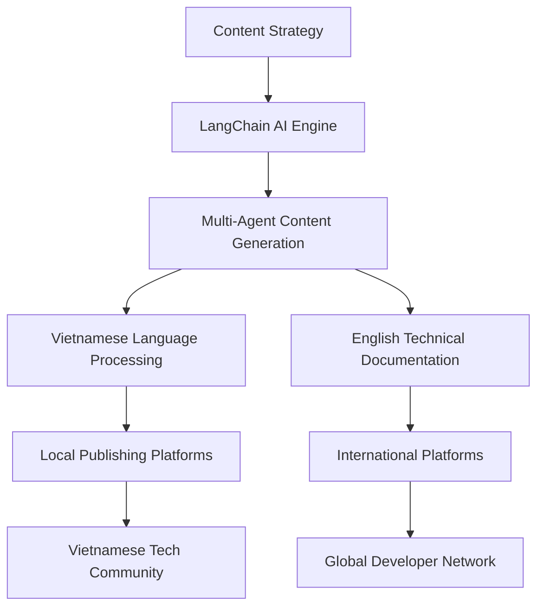

# 🤖 AI Blogging System - Automated Content Generation Platform

[](https://github.com/DKledx/Ai-blogging-system-app/stargazers)
[](https://opensource.org/licenses/MIT)
[](https://github.com/DKledx/Ai-blogging-system-app)

> **AI-powered blogging and knowledge sharing system for Vietnamese tech community with global reach**

## 🌐 Language / Ngôn ngữ

- **🇺🇸 English**: [Current] - Technical documentation and international collaboration
- **🇻🇳 Tiếng Việt**: [Vietnamese Version](README.vi.md) - Community focus and detailed guides

## 🎯 Project Overview

The **AI Blogging System** is an innovative platform that combines **LangChain/LangGraph** technology with automated content generation to create a comprehensive knowledge-sharing ecosystem. Our mission is to bridge the gap between Vietnamese tech talent and the global technology community through high-quality, AI-generated content.

### 🚀 Key Features

- **🤖 AI-Powered Content Generation**: LangChain/LangGraph multi-agent system
- **🌏 Multi-Platform Publishing**: Automated distribution across platforms
- **🇻🇳 Vietnamese Language Optimization**: Specialized AI for technical content in Vietnamese
- **📊 Analytics & Insights**: Community engagement tracking
- **🔄 Bilingual Support**: Seamless Vietnamese-English content management
- **👥 Community-Driven**: Open source collaboration and contribution

## 🏗️ Architecture Overview



## 📚 Documentation Structure

```
docs/
├── en/                    # English Documentation
│   ├── content/          # Technical guides and references
│   ├── strategy/         # Business strategy and roadmaps
│   └── management/       # Project management docs
├── vi/                   # Vietnamese Documentation  
│   ├── content/          # Detailed tutorials and community guides
│   ├── strategy/         # Chiến lược và kế hoạch triển khai
│   └── management/       # Quản lý dự án và GitHub setup
└── shared/               # Language-agnostic resources
    ├── diagrams/         # Architecture diagrams
    ├── images/           # Screenshots and visuals
    └── code/             # Code samples and templates
```

## 🔥 Quick Start

### Prerequisites
- **Python 3.9+** with FastAPI framework
- **Node.js 18+** for React/Next.js frontend
- **Docker & Docker Compose** for containerization
- **LangChain/LangGraph** for AI content generation
- **PostgreSQL** for data storage

### Installation

```bash
# Clone the repository
git clone https://github.com/DKledx/Ai-blogging-system-app.git
cd Ai-blogging-system-app

# Setup development environment
docker-compose up -d

# Install dependencies
pip install -r requirements.txt
npm install

# Initialize database
python manage.py migrate

# Start development servers
python manage.py runserver  # Backend API
npm run dev                 # Frontend application
```

## 🎯 Project Milestones

| Phase | Timeline | Focus | Status |
|-------|----------|-------|---------|
| **Foundation & MVP** | Aug 2025 | Technical foundation & basic AI content | 🚧 In Progress |
| **Scale & Automation** | Oct 2025 | Advanced features & multi-platform | 📅 Planned |
| **Community & Growth** | Dec 2025 | Community platform & user acquisition | 📅 Planned |
| **Enterprise & Monetization** | Jun 2026 | Business features & revenue generation | 📅 Planned |

## 🌟 Core Chapters

### 🧠 [Ontological AI - Strategic Foundation](docs/en/content/ontological-ai/)
Leadership excellence, AI strategy, and organizational transformation for tech leaders.

### 🤖 [AI & Machine Learning](docs/en/content/ai-ml-chapter/)
Comprehensive guides for AI engineering, data science, and MLOps implementation.

### 💻 [Software Engineering](docs/en/content/software-engineering-chapter/)
Best practices for fullstack development, mobile apps, and engineering excellence.

### 📊 [Product & Digital Strategy](docs/en/content/product-digital-chapter/)
Product management, business strategy, and digital transformation guidance.

### 🏗️ [Platform & Infrastructure](docs/en/content/platform-infrastructure-chapter/)
DevOps, cloud architecture, security, and system design expertise.

## 🤝 Contributing

We welcome contributions from developers worldwide! Please read our [Contributing Guidelines](CONTRIBUTING.md) for details on:

- **Code Standards**: ESLint, Prettier, and Python formatting
- **Issue Templates**: Bug reports and feature requests
- **Pull Request Process**: Review and approval workflow
- **Community Guidelines**: Code of conduct and collaboration

### 🌍 International Collaboration

- **English Issues**: Technical discussions and feature development
- **Vietnamese Community**: [Vietnamese Discord](https://discord.gg/your-server) for local support
- **Cross-Cultural Projects**: Bridging Vietnamese talent with global opportunities

## 📊 Success Metrics

### Technical Goals (2025)
- ✅ **MVP Launch**: Basic AI content generation system
- 🎯 **Content Quality**: 95%+ accuracy in technical translations
- 🎯 **Performance**: Sub-30-second content generation
- 🎯 **Platforms**: 5+ integrated publishing platforms

### Community Goals (2025-2026)
- 🎯 **Vietnamese Community**: 10,000+ active members
- 🎯 **International Reach**: 1,000+ GitHub stars
- 🎯 **Content Output**: 1,000+ AI-generated articles per month
- 🎯 **Global Impact**: 50+ countries with active users

## 🔮 Future Vision

**AI Blogging System** aims to become:
- **#1 Vietnamese Technical Content Platform** with global standards
- **Premier Example of Bilingual Open Source Documentation**
- **Bridge Between Vietnamese Tech Community and Global Ecosystem**
- **Industry Standard for AI-Powered Content Generation**

## 📄 License

This project is licensed under the **MIT License** - see the [LICENSE](LICENSE) file for details.

## 🙏 Acknowledgments

- **Vietnamese Tech Community** for inspiration and feedback
- **Open Source Contributors** from around the world
- **LangChain/LangGraph Teams** for cutting-edge AI technology
- **Global Developer Community** for collaboration and knowledge sharing

---

## 📞 Connect With Us

- **🌐 Website**: [Coming Soon]
- **📧 Email**: contact@ai-blogging-system.com
- **🐦 Twitter**: [@AiBloggingVN](https://twitter.com/AiBloggingVN)
- **💬 Discord**: [Vietnamese Tech Community](https://discord.gg/your-server)
- **📱 LinkedIn**: [AI Blogging System](https://linkedin.com/company/ai-blogging-system)

> **"Empowering Vietnamese tech talent to share knowledge globally through AI-powered content generation"**
