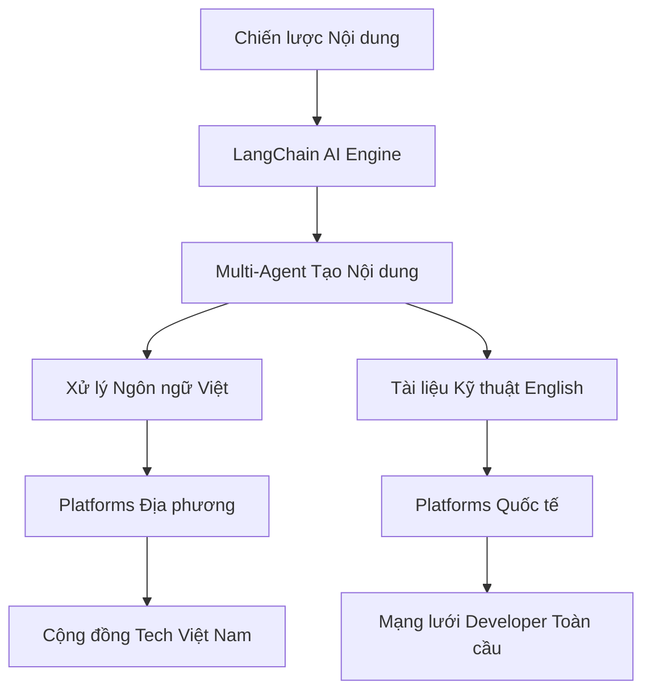

# 🤖 AI Blogging System - Hệ thống Tạo nội dung Tự động

[](https://github.com/DKledx/Ai-blogging-system-app/stargazers)
[](https://opensource.org/licenses/MIT)
[](https://github.com/DKledx/Ai-blogging-system-app)

> **Hệ thống AI blogging và chia sẻ kiến thức kỹ thuật cho cộng đồng Việt Nam với tầm nhìn toàn cầu**

## 🌐 Language / Ngôn ngữ

- **🇻🇳 Tiếng Việt**: [Hiện tại] - Focus cộng đồng và hướng dẫn chi tiết
- **🇺🇸 English**: [English Version](README.md) - Technical documentation và collaboration quốc tế

## 🎯 Tổng quan Dự án

**AI Blogging System** là nền tảng sáng tạo kết hợp công nghệ **LangChain/LangGraph** với tạo nội dung tự động để xây dựng hệ sinh thái chia sẻ kiến thức toàn diện. Sứ mệnh của chúng tôi là kết nối tài năng công nghệ Việt Nam với cộng đồng công nghệ toàn cầu thông qua nội dung chất lượng cao được tạo bởi AI.

### 🚀 Tính năng Chính

- **🤖 Tạo nội dung bằng AI**: Hệ thống multi-agent LangChain/LangGraph
- **🌏 Đăng bài Đa nền tảng**: Tự động phân phối content trên nhiều platform
- **🇻🇳 Tối ưu tiếng Việt**: AI chuyên biệt cho nội dung kỹ thuật tiếng Việt
- **📊 Phân tích & Thông tin**: Theo dõi tương tác cộng đồng
- **🔄 Hỗ trợ Song ngữ**: Quản lý nội dung Việt-Anh liền mạch
- **👥 Cộng đồng Định hướng**: Hợp tác và đóng góp mã nguồn mở

## 🏗️ Tổng quan Kiến trúc



## 📚 Cấu trúc Documentation

```
docs/
├── vi/                   # Tài liệu Tiếng Việt
│   ├── content/          # Tutorials chi tiết và hướng dẫn cộng đồng
│   ├── strategy/         # Chiến lược và kế hoạch triển khai
│   └── management/       # Quản lý dự án và GitHub setup
├── en/                   # English Documentation
│   ├── content/          # Technical guides và references
│   ├── strategy/         # Business strategy và roadmaps
│   └── management/       # Project management docs
└── shared/               # Tài nguyên không phụ thuộc ngôn ngữ
    ├── diagrams/         # Biểu đồ kiến trúc
    ├── images/           # Screenshots và visuals
    └── code/             # Code samples và templates
```

## 🔥 Bắt đầu Nhanh

### Yêu cầu Hệ thống
- **Python 3.9+** với FastAPI framework
- **Node.js 18+** cho React/Next.js frontend
- **Docker & Docker Compose** cho containerization
- **LangChain/LangGraph** cho AI content generation
- **PostgreSQL** cho lưu trữ dữ liệu

### Cài đặt

```bash
# Clone repository
git clone https://github.com/DKledx/Ai-blogging-system-app.git
cd Ai-blogging-system-app

# Setup môi trường development
docker-compose up -d

# Cài đặt dependencies
pip install -r requirements.txt
npm install

# Khởi tạo database
python manage.py migrate

# Chạy development servers
python manage.py runserver  # Backend API
npm run dev                 # Frontend application
```

## 🎯 Milestones Dự án

| Giai đoạn | Timeline | Focus | Trạng thái |
|-----------|----------|-------|------------|
| **Foundation & MVP** | Tháng 8, 2025 | Technical foundation & basic AI content | 🚧 Đang thực hiện |
| **Scale & Automation** | Tháng 10, 2025 | Advanced features & multi-platform | 📅 Đã lên kế hoạch |
| **Community & Growth** | Tháng 12, 2025 | Community platform & user acquisition | 📅 Đã lên kế hoạch |
| **Enterprise & Monetization** | Tháng 6, 2026 | Business features & revenue generation | 📅 Đã lên kế hoạch |

## 🌟 Chapters Chính

### 🧠 [Ontological AI - Strategic Foundation](docs/vi/content/ontological-ai/)
**Leadership Lab** - Excellence trong leadership, AI strategy, và organizational transformation cho tech leaders.

### 🤖 [AI & Machine Learning](docs/vi/content/ai-ml-chapter/)
Hướng dẫn toàn diện cho AI engineering, data science, và triển khai MLOps.

### 💻 [Software Engineering](docs/vi/content/software-engineering-chapter/)
Best practices cho fullstack development, mobile apps, và engineering excellence.

### 📊 [Product & Digital Strategy](docs/vi/content/product-digital-chapter/)
Product management, business strategy, và hướng dẫn digital transformation.

### 🏗️ [Platform & Infrastructure](docs/vi/content/platform-infrastructure-chapter/)
Chuyên môn DevOps, cloud architecture, security, và system design.

## 🤝 Đóng góp

Chúng tôi chào đón đóng góp từ developers toàn thế giới! Vui lòng đọc [Hướng dẫn Đóng góp](CONTRIBUTING.md) để biết chi tiết về:

- **Code Standards**: ESLint, Prettier, và Python formatting
- **Issue Templates**: Bug reports và feature requests
- **Pull Request Process**: Review và approval workflow
- **Community Guidelines**: Code of conduct và collaboration

### 🌍 Hợp tác Quốc tế

- **English Issues**: Technical discussions và feature development
- **Cộng đồng Việt Nam**: [Vietnamese Discord](https://discord.gg/your-server) cho support địa phương
- **Cross-Cultural Projects**: Kết nối tài năng Việt Nam với cơ hội toàn cầu

## 📊 Metrics Thành công

### Mục tiêu Kỹ thuật (2025)
- ✅ **MVP Launch**: Hệ thống AI content generation cơ bản
- 🎯 **Chất lượng Content**: 95%+ độ chính xác trong technical translations
- 🎯 **Performance**: Tạo content dưới 30 giây
- 🎯 **Platforms**: 5+ integrated publishing platforms

### Mục tiêu Cộng đồng (2025-2026)
- 🎯 **Cộng đồng Việt Nam**: 10,000+ thành viên tích cực
- 🎯 **Tầm với Quốc tế**: 1,000+ GitHub stars
- 🎯 **Content Output**: 1,000+ AI-generated articles mỗi tháng
- 🎯 **Global Impact**: 50+ quốc gia có users tích cực

## 🔮 Tầm nhìn Tương lai

**AI Blogging System** hướng tới trở thành:
- **#1 Vietnamese Technical Content Platform** với tiêu chuẩn toàn cầu
- **Premier Example of Bilingual Open Source Documentation**
- **Cầu nối giữa Vietnamese Tech Community và Global Ecosystem**
- **Industry Standard cho AI-Powered Content Generation**

## 📄 Giấy phép

Dự án này được licensed dưới **MIT License** - xem file [LICENSE](LICENSE) để biết chi tiết.

## 🙏 Lời cảm ơn

- **Cộng đồng Tech Việt Nam** cho inspiration và feedback
- **Open Source Contributors** từ khắp nơi trên thế giới
- **LangChain/LangGraph Teams** cho công nghệ AI tiên tiến
- **Global Developer Community** cho collaboration và knowledge sharing

---

## 📞 Kết nối với chúng tôi

- **🌐 Website**: [Sắp ra mắt]
- **📧 Email**: contact@ai-blogging-system.com
- **🐦 Twitter**: [@AiBloggingVN](https://twitter.com/AiBloggingVN)
- **💬 Discord**: [Vietnamese Tech Community](https://discord.gg/your-server)
- **📱 LinkedIn**: [AI Blogging System](https://linkedin.com/company/ai-blogging-system)

> **"Trao quyền cho tài năng tech Việt Nam chia sẻ kiến thức toàn cầu thông qua AI-powered content generation"**
